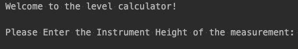

### Calculate Level

I work at a construction site. I hate when people calculate simple with errors.
I automate the work for them(and for myself).

## Plan

## ScreenShots
First input the Instrument Height

Then input the Acceptable Variation

Takes input from user, 'n' to stop input

Output to CSV

